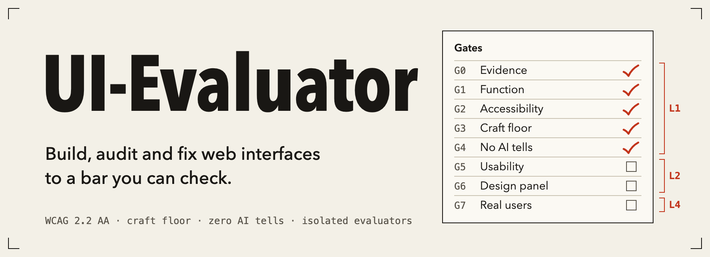
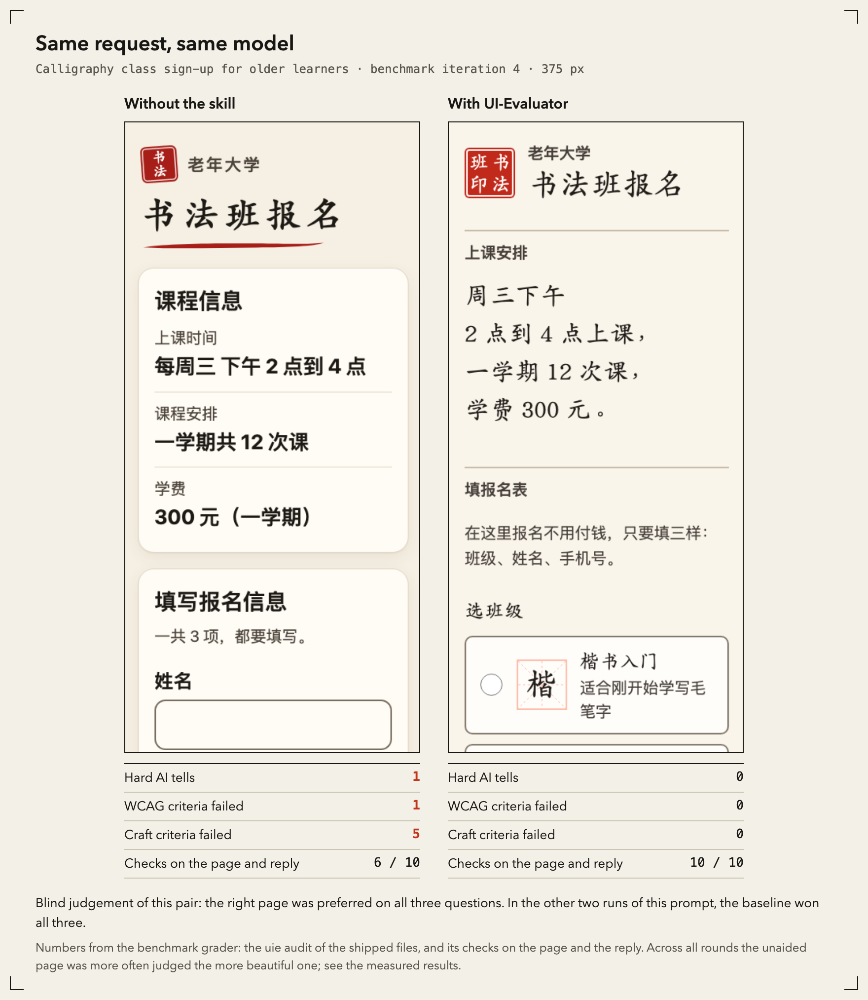
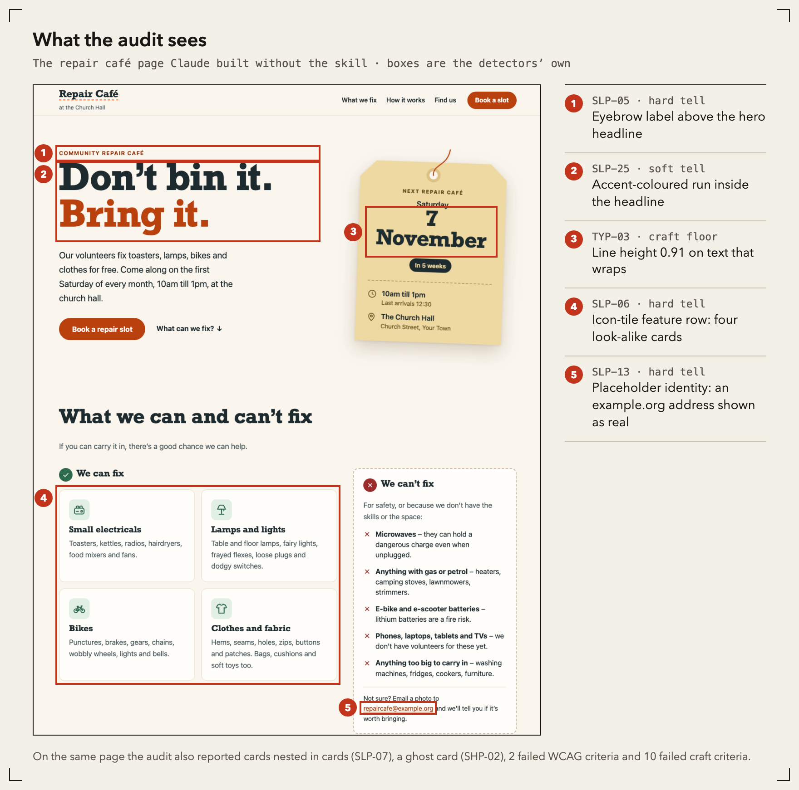
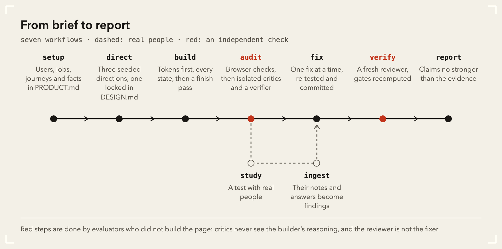

<p align="center">
  
</p>

<p align="center">
  <b>English</b> · <a href="README.zh-CN.md">中文</a> · <a href="#install">Install</a> · <a href="#measured-results">Measured results</a> · <a href="docs/README.md">Documentation</a>
</p>

<p align="center">
  <a href="https://github.com/Horace-Maxwell/UI-Evaluator/releases/latest"></a>
  <a href="LICENSE"></a>
  
  
</p>

Ask a coding agent for a web page and you get one in minutes. Too often it is the same page: a tracked-caps label over the headline, half the headline in the accent colour, a row of icon cards, and an address nobody checked.

**UI-Evaluator** is an Agent Skill and Claude Code plugin that gives the agent a method instead of taste alone. It starts from the product, not from defaults. It checks the rendered page in a real browser. Critics who never saw the builder's reasoning judge the design. It fixes one verified problem at a time, and its report claims no more than the evidence shows.

## Before and after

Same prompt, same model: one page built without the skill, one with it. Under each page are the numbers from the `uie` audit of the shipped files.




> [!NOTE]
> These two pairs were picked because the project owner, judging blind, preferred the skill's page in both. They are not typical. Across the four benchmark rounds, the page built without the skill was more often judged the more beautiful one. What the skill changes reliably is the numbers: no hard AI tells, the accessibility floor, honest content and the brief met. See [Measured results](#measured-results).

## Findings you can check

Every finding carries a rule ID, a location and its evidence. The boxes below are the detectors' own bounding boxes on the repair café page built without the skill.



## How it works



- **Build from the product, not from defaults.** `PRODUCT.md` records who the users are and the one job of each page. `DESIGN.md` (Google's design.md format) records tokens and decisions. A seeded roll deals three directions, one of them from beyond the model's favourites, and a ledger keeps the next project from repeating this one.
- **Audit like a usability lab.** Deterministic browser checks run first: axe, keyboard, contrast on the composited background, layout, motion, target sizes and AI tells. Then isolated evaluators take over: three or more heuristic evaluators, cognitive walkthroughs per persona and journey, a design panel and an accessibility auditor. A verifier re-checks every candidate finding against the rendered page, and at least three raters rate its severity blind.
- **Bring in real people.** Usability-test notes, survey answers, tickets and reviews are imported, scrubbed of personal data, grouped into themes with counts and linked to findings. Statistics such as SUS, SEQ, adjusted-Wald intervals and Krippendorff's α are computed by script, never by hand.
- **Fix one thing at a time.** Each fix is re-tested and committed on its own, and a reviewer who did not make it confirms it. Loops have budgets and a risk stop.
- **Report honestly.** Reports are generated from the run's files. A language lint blocks "users struggle…" without observed evidence, causal claims without an experiment, and any claim of completeness or WCAG conformance.

## What "100%" means here

No process can prove beauty. UI-Evaluator turns the aim into the strongest claims that can be checked, and refuses to claim more. A run reports the highest level it has shown:

| Level | Name | What has been shown |
|---|---|---|
| L1 | Machine-verified | every deterministic check passes: evidence integrity, functional integrity, automatable WCAG 2.2 AA, the measurable craft floor, zero unaccepted AI tells |
| L2 | Panel-reviewed | L1, plus isolated evaluators and a design panel found no open severe problem and judged the design specific to this product and appealing to its audience |
| L3 | Human-confirmed | L2, plus a person confirmed the needs-human WCAG checks, the severe findings and the design verdict |
| L4 | User-validated | L3, plus formative tests with real users met the task criteria, with every severe observed problem fixed and re-tested |

Each criterion is `pass`, `fail`, `not_run`, `not_applicable`, `degraded` or `waived`. `not_run` never counts as a pass.

<details>
<summary><b>The eight gates</b></summary>

| Gate | What it checks | Counts toward |
|---|---|---|
| G0 Evidence integrity | complete run manifest, a passing tool smoke test, valid captures, a resolvable anchor for every finding, wording within the evidence | L1 |
| G1 Functional integrity | every route loads, no console errors, critical journeys complete, no overflow or clipped text at any width, layout shift ≤ 0.1 | L1 |
| G2 Accessibility | WCAG 2.2 AA: axe, keyboard, visible and unobscured focus, dialogs, reflow at 320 px, target size, contrast, forms, language | L1 for the automatable parts, L2 for all |
| G3 Craft floor | type size, line height and measure, colour and spacing tokens, radii, depth, motion and reduced motion, component states, copy | L1 |
| G4 Deliberateness | `PRODUCT.md` and `DESIGN.md`, a recorded direction, no hard AI tells, a decision for every soft one | L1 |
| G5 Analytical usability | isolated heuristic evaluators and walkthroughs, merged, verified and rated blind; no open P0, a decision for every P1 | L2 |
| G6 Design panel | at least three isolated critics judge specificity, brand fit and appeal; scores are reported but never pass a page | L2 |
| G7 Empirical validation | moderated rounds of about five people, critical tasks completed unassisted by at least 80%, observed problems fixed and re-tested | L4 |

Every criterion has an ID, a threshold, a way to verify it and a source in [QUALITY-BAR.md](docs/framework/QUALITY-BAR.md).

</details>

## Install

**Claude Code (plugin, recommended).** Adds the skill, nine slash commands, nine isolated subagents and an optional lint hook. In a Claude Code session:

```
/plugin marketplace add Horace-Maxwell/UI-Evaluator
/plugin install ui-evaluator@ui-evaluator
```

**Any Agent Skills client** (Claude Code, Codex, Cursor, Gemini CLI and others): copy or link `skills/ui-evaluator/` into the client's skills folder, or use the skills installer:

```bash
npx skills add Horace-Maxwell/UI-Evaluator
```

**Requirements.** Node.js 20 or newer. The core CLI has no dependencies. Browser checks use Playwright with Chromium; the skill asks before installing them and runs `uie doctor --install` only with your agreement. Without a browser it still works from source code and screenshots, and says which checks it could not run.

## Use

Talk to your agent normally. The skill triggers on requests such as:

- "Build a booking page for our clinic. Here's what it needs to do…"
- "Review this dashboard for usability and accessibility before we ship."
- "这个页面看起来很像 AI 做的，帮我改得有设计感一点。"
- "Here are the notes from five usability sessions. What should we fix first?"
- "Is this ready to ship?"

In Claude Code you can also call a workflow directly:

| Command | Workflow |
|---|---|
| `/ui-evaluator:setup` | product context, tooling, `PRODUCT.md`, journeys, scope |
| `/ui-evaluator:direct` | design direction for new work: candidates, seeded roll, convergence tests, locked `DESIGN.md` |
| `/ui-evaluator:build` | build to the floor: tokens first, full states, copy, responsive, accessibility, motion last, finish pass |
| `/ui-evaluator:audit` | evidence, deterministic checks, isolated evaluators, verification, blind rating, gates, report |
| `/ui-evaluator:study` | plan a usability test, survey or experiment |
| `/ui-evaluator:ingest` | user feedback and study results into themes, linked findings and re-rated severity |
| `/ui-evaluator:fix` | one verified fix at a time from the prioritised queue |
| `/ui-evaluator:verify` | run diff, fix review, regression check, gates |
| `/ui-evaluator:report` | the honest report and the stakeholder agree/disagree sheet |

<details>
<summary><b>The <code>uie</code> command line</b></summary>

The agent runs the bundled CLI (`node skills/ui-evaluator/scripts/uie.mjs`, called `uie` below). You can run it too:

| Command | What it does |
|---|---|
| `uie doctor [--install]` | check Node, the browser runtime and the smoke test |
| `uie init` · `uie detect` | scaffold `.ui-evaluator/`; scan the project's stack, tokens and routes |
| `uie capture` · `uie audit` · `uie probe` · `uie journey` | screenshots and ARIA snapshots; deterministic page checks; scripted interactions; journey replay |
| `uie lint` | static source scan for tells, motion, token drift and accessibility source rules |
| `uie packet` | build the input packet for each isolated role |
| `uie findings …` | validate, merge, verify, rate, promote, queue, link and close findings |
| `uie gates` · `uie report` | criterion and gate states and the assurance level; the report with its language lint |
| `uie tokens check\|extract` | check `DESIGN.md` values; draft an as-built `DESIGN.md` from shipped source |
| `uie roll` · `uie ledger` | seeded direction deal; the variety ledger |
| `uie feedback import\|stats\|set\|themes\|selftest` | import and scrub feedback; counts; themes |
| `uie study …` | outcomes, CIs, SUS, SEQ, UMUX-Lite, TLX, sample sizes, A/B sizing, SRM, RITE, Krippendorff's α |

Run `uie <command> --help` for options. Everything the CLI writes lives in `.ui-evaluator/` in your project. Screenshots, packets and raw feedback are git-ignored by default.

</details>

## How it avoids the AI look

The generic look comes from defaults that nobody decided. The skill makes decisions visible and checkable:

1. **Context first.** Each surface has one job and one mode (persuade, operate, read, experience) in `PRODUCT.md`. A brand is described as three to five "X, not Y" attributes.
2. **Directions from the audience's world,** not from the model's favourite. `uie roll` deals three directions with a seed: one from beyond the model's top two, the model's own pick with a familiarity note, and the conventional option. Swap, category and similarity tests decide.
3. **Tells are named and counted.** A catalogue of AI tells (gradient text, tracked-caps eyebrows on every section, three equal icon cards, invented social proof, bounce easing on UI state…) is checked in code and in the render. Hard tells must be absent. Soft tells need a decision: fixed, accepted in `DESIGN.md` with a reason, disputed or deferred.
4. **Isolated critics** judge specificity, brand fit and appeal from screenshots before they may see detector output, and never see the builder's rationale.
5. **A ledger** stops the next project from repeating the last one's display face and page structure.
6. **Not bare either.** Avoiding defaults must not leave a page empty. The build ends with a finish pass, and the critics' appeal verdict fails a page that is clean but plain. The subject's own materials, such as a calligraphy class's paper and seal, are references to use with the product's specifics, not tells to avoid ([ADR-035](docs/framework/DECISIONS.md#adr-035--appeal-is-judged-and-gates-g6)).

## Measured results

Four build iterations on four prompts, 14 runs with the skill and 8 without, all built by Claude models and graded by the same script. Data, method and caveats: [evals/README.md](evals/README.md#results).

| | With the skill | Without |
|---|---|---|
| Checks on the page and the reply (the same for both) | 83–100% | 0–70% |
| Hard AI tells | none | in most runs (7 of 8 in the latest round) |
| Invented contact details, prices or testimonials | none | in several runs |
| Blind human judgement, latest round: more beautiful | 2 of 8 | 6 of 8 |
| Blind human judgement: less template-like | 3 of 8 | 5 of 8 |
| Blind human judgement: would publish | 2 of 8 (1 tie) | 5 of 8 |
| Median cost of one build | about 860k tokens, 94 min | about 315k tokens, 41 min |

The grader also checks the skill's own files (PRODUCT.md, DESIGN.md, the direction roll, the ledger), which a build without the skill cannot have. Counting those as well gives 90–100% against 0–64%, but that gap is partly built in, so the table leaves them out.

- **The detectors find their seeded defects.** On six fixtures at 320, 768 and 1280 px, the audit and lint found all 51 deterministic seeded defects and reported no false positive on the clean control page. The fixtures are small, so this does not estimate precision on real sites.
- **The skill reliably lifts what it can verify.** It costs about 2.7 times the tokens and 2.3 times the time of an unaided build, mostly in audits, gates and records.
- **It does not yet reliably win on looks.** Runs vary widely: the same calligraphy prompt won all three questions in one run and lost all three in the other two. Model judges agreed with the person on beauty in 7 of 8 pairs, but credited the skill's concepts as less generic more often than the person did.

These are one judge, small samples and one model family. Thresholds marked **[calibrating]** in the quality bar are initial values that the [evaluation plan](docs/framework/EVALUATION-PLAN.md) measures and revises by decision record, and the [decision records](docs/framework/DECISIONS.md) from ADR-035 on say what changed after each measurement.

## Repository layout

```
skills/ui-evaluator/      the portable skill: SKILL.md, references (workflows, methods, knowledge,
                          evaluator roles, templates), scripts (uie CLI), assets (schemas, rules, data)
agents/                   Claude Code subagents generated from the evaluator roles
commands/  hooks/         Claude Code slash commands and the optional lint hook
.claude-plugin/           plugin manifest and marketplace entry
docs/framework/           the specification: framework, quality bar, methods, architecture, decisions,
                          conflict register, authoring rules, evaluation plan, traceability, glossary
docs/research/            the evidence base: eleven research notes, 592 adopt items with sources
docs/assets/              the images in this README and where each one comes from
evals/                    fixtures, prompts and assertions; evals/results/ holds every benchmark round
tests/                    unit and integration tests
tools/                    maintenance scripts; bench/ runs the build benchmark, readme-media/ draws these images
```

## Develop

```bash
npm test
```

```bash
npm run validate
```

`npm test` runs the core tests (no dependencies). `npm run validate` checks packaging, links, agents and rules against the specification, and research traceability. [tools/bench/](tools/bench/README.md) runs the build benchmark, and `node tools/readme-media/build.mjs` redraws the images in this README from its stored results. See [CONTRIBUTING.md](CONTRIBUTING.md).

## Licence and acknowledgements

Apache-2.0. UI-Evaluator builds on published research and on ideas from open-source design and evaluation skills; sources, licences and attributions are in [NOTICE.md](NOTICE.md) and in each research note. The methodological backbone follows Alexandra Ion's lecture *Evaluation: Analytical vs Empirical* (Carnegie Mellon University, HCII). The pages in the images above were built by Claude during the benchmark; [docs/assets/README.md](docs/assets/README.md) says which run each one comes from.
