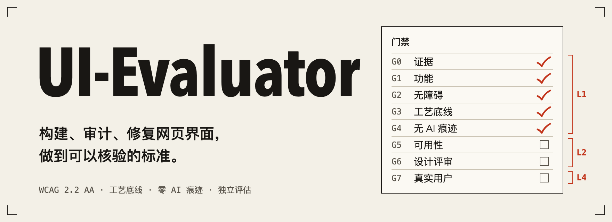
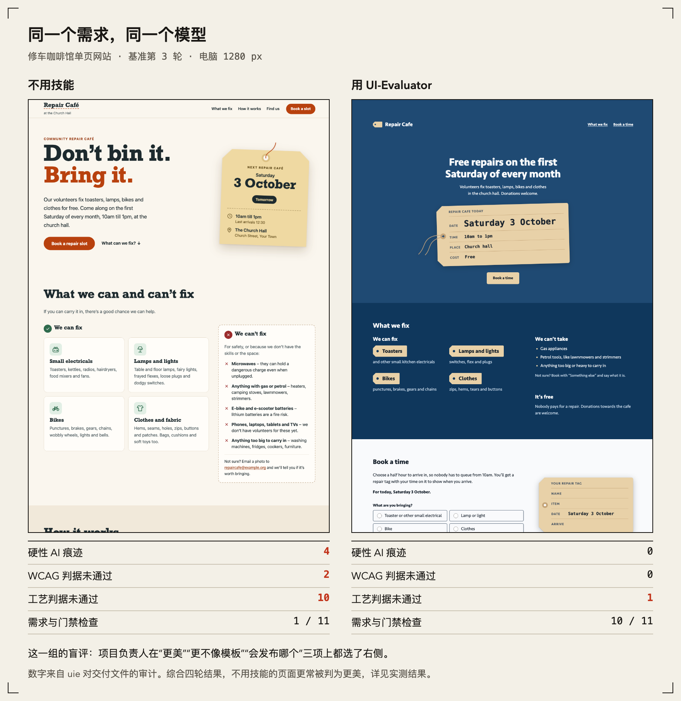
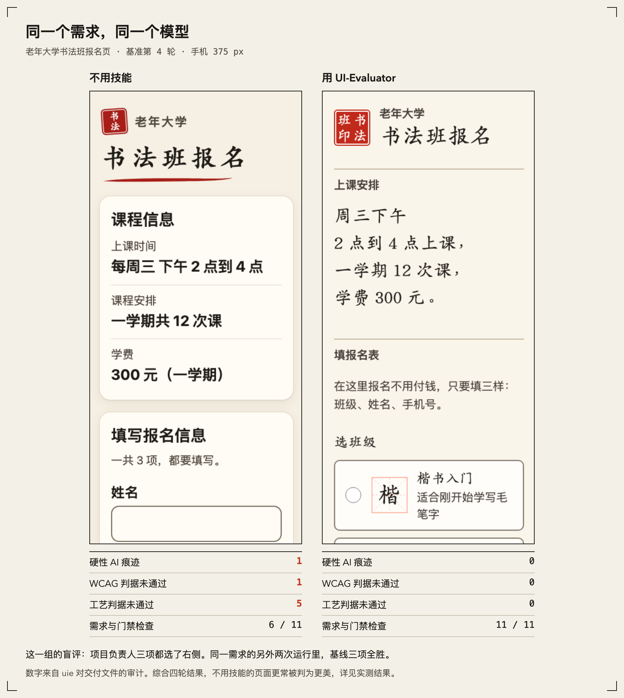
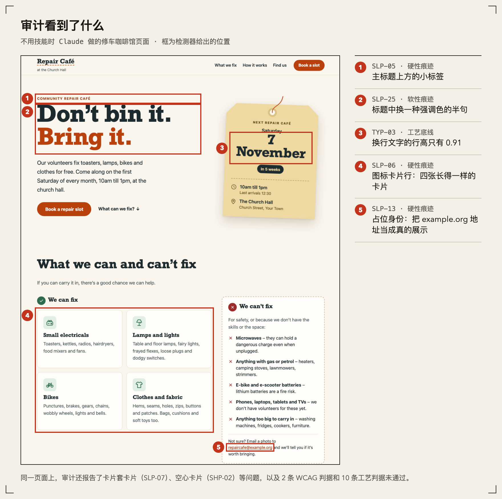
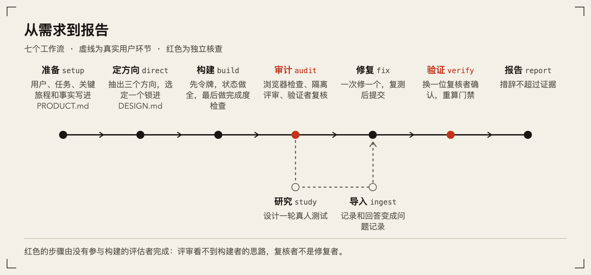

<p align="center">
  
</p>

<p align="center">
  <a href="README.md">English</a> · <b>中文</b> · <a href="#安装">安装</a> · <a href="#实测结果">实测结果</a> · <a href="docs/OVERVIEW.zh-CN.md">中文总览</a>
</p>

<p align="center">
  <a href="https://github.com/Horace-Maxwell/UI-Evaluator/releases/latest"></a>
  <a href="LICENSE"></a>
  
  
</p>

让编程智能体做一个网页，几分钟就能拿到。可惜做出来的常常是同一个页面：标题上方一行字距拉开的大写小标签，标题后半句换成强调色，一排图标卡片，再加一个没人核对过的地址。

**UI-Evaluator** 是一个 Agent Skill，也是一个 Claude Code 插件。它给智能体的是一套方法，而不只是“审美”：从产品本身出发，而不是从默认值出发；在真实浏览器里检查渲染出来的页面；由从没看过构建者思路的评审来判断设计；一次只修一个经过验证的问题；报告里的每句话都不超过证据能支持的范围。

## 用之前和用之后

同一个需求，同一个模型：一个页面不用技能，一个用技能。每个页面下方是 `uie` 对交付文件的审计数字。





> [!NOTE]
> 这两组是挑出来的：项目负责人盲评时，这两组都选了技能版。它们并不典型。四轮基准测试综合来看，不用技能的页面更常被判为更美。技能稳定改变的是那几行数字：没有硬性 AI 痕迹，守住无障碍底线，内容不编造，满足需求。详见[实测结果](#实测结果)。

## 每条问题都能核对

每条问题都带有规则编号、位置和证据。下图中的框是检测器自己给出的位置，页面是不用技能时做的修车咖啡馆。



## 工作方式



- **从产品出发，而不是从默认值出发。** `PRODUCT.md` 记录用户是谁、每个页面唯一要完成的事；`DESIGN.md`（采用 Google 的 design.md 格式）记录设计令牌和决策。带种子的抽签会发出三个方向，其中一个来自模型最想选的前两名之外；方向台账防止下一个项目重复这一个。
- **像可用性实验室那样审计。** 先跑确定性的浏览器检查：axe、键盘、在合成背景上算对比度、布局、动效、触控目标和 AI 痕迹。然后交给彼此隔离的评估者：至少三名启发式评估员、按用户画像和关键旅程做的认知走查、设计评审小组和无障碍审查员。每条候选问题都由验证者在渲染出的页面上复核，严重度由至少三名评分者盲评。
- **引入真实用户。** 可用性测试记录、问卷回答、工单和评论会被导入并清除个人信息，归纳成带计数的主题，再和问题记录关联。SUS、SEQ、调整 Wald 区间、Krippendorff α 等统计一律由脚本计算，绝不手算。
- **一次只修一个问题。** 每次修复单独复测、单独提交，并由没有参与修复的复核者确认。循环有预算上限和风险熔断。
- **诚实地报告。** 报告由运行目录里的文件生成。语言检查会拦下这些说法：没有观察证据就说“用户很困惑”，没有实验就下因果结论，以及任何“问题已全部解决”“完全符合 WCAG”之类的声明。

## 这里的“100%”是什么意思

没有任何流程能“证明”美。UI-Evaluator 把这个目标转化为能被检验的最强承诺，并且拒绝说得更多。每次运行都报告自己实际达到的最高等级：

| 等级 | 名称 | 已经证明了什么 |
|---|---|---|
| L1 | 机器验证 | 所有确定性检查通过：证据完整、功能完整、可自动检查的 WCAG 2.2 AA、可度量的工艺底线、零个未被接受的 AI 痕迹 |
| L2 | 评审团通过 | 在 L1 之上，隔离的评估者和设计评审团没有发现未解决的严重问题，并判定设计专属于这个产品、对它的受众有吸引力 |
| L3 | 人工确认 | 在 L2 之上，由真人确认了需要人工判断的 WCAG 项、严重问题和设计结论 |
| L4 | 用户验证 | 在 L3 之上，真实用户的形成性测试达到任务标准，所有观察到的严重问题都已修复并复测 |

每条判据的状态只能是 `pass`、`fail`、`not_run`、`not_applicable`、`degraded` 或 `waived`；`not_run`（未运行）永远不算通过。

<details>
<summary><b>八道门禁</b></summary>

| 门禁 | 检查什么 | 计入 |
|---|---|---|
| G0 证据完整性 | 运行清单齐全，工具冒烟测试通过，截图有效，每条问题都能定位，措辞不超过证据 | L1 |
| G1 功能完整性 | 每个页面都能加载，控制台无报错，关键旅程走得通，任何宽度下都没有横向溢出或文字被截断，布局偏移 ≤ 0.1 | L1 |
| G2 无障碍 | WCAG 2.2 AA：axe、键盘、焦点可见且不被遮挡、对话框、320 px 下可重排、目标尺寸、对比度、表单、语言 | 可自动检查的部分计入 L1，全部计入 L2 |
| G3 工艺底线 | 字号、行高与行长，颜色和间距令牌，圆角，层次，动效与减少动态，组件状态，文案 | L1 |
| G4 刻意性 | `PRODUCT.md` 和 `DESIGN.md`、有记录的方向决策、零个硬性 AI 痕迹、每个软性痕迹都有处置 | L1 |
| G5 分析式可用性 | 隔离的启发式评估员和认知走查，经过合并、验证和盲评；没有未处理的 P0，每个 P1 都有决定 | L2 |
| G6 设计评审 | 至少三名隔离的评审判断针对性、品牌契合度和吸引力；评分只作参考，从不作为通过依据 | L2 |
| G7 实证验证 | 每轮约五名用户的主持式测试，关键任务无协助完成率至少 80%，观察到的问题修复后复测 | L4 |

每条判据都有编号、阈值、验证方式和出处，见 [QUALITY-BAR.md](docs/framework/QUALITY-BAR.md)。

</details>

## 安装

**Claude Code（插件，推荐）**：包含技能本体、9 个斜杠命令、9 个隔离子智能体和一个可选的代码检查钩子。在 Claude Code 会话中输入：

```
/plugin marketplace add Horace-Maxwell/UI-Evaluator
/plugin install ui-evaluator@ui-evaluator
```

**任何支持 Agent Skills 的客户端**（Claude Code、Codex、Cursor、Gemini CLI 等）：把 `skills/ui-evaluator/` 复制或链接到客户端的 skills 目录，或者使用安装器：

```bash
npx skills add Horace-Maxwell/UI-Evaluator
```

**环境要求**：Node.js 20 或更高版本。核心命令行工具零依赖。浏览器检查使用 Playwright 和 Chromium；技能会先征求你的同意，才会运行 `uie doctor --install` 安装它们。没有浏览器时，它仍能基于源代码和截图工作，并明确列出哪些检查没能运行。

## 使用

像平常一样和智能体对话即可，例如：

- “帮我们诊所做一个预约页面，需求如下……”
- “上线前帮我从可用性和无障碍角度审一下这个后台。”
- “这个页面看起来很像 AI 做的，帮我改得有设计感一点。”
- “这是五场可用性测试的记录，先修哪个？”
- “这个能上线了吗？”

在 Claude Code 里也可以直接调用工作流：

| 命令 | 工作流 |
|---|---|
| `/ui-evaluator:setup` | 产品语境、工具、`PRODUCT.md`、关键旅程、评审范围 |
| `/ui-evaluator:direct` | 新作品的设计方向：候选方向、种子抽签、趋同测试、锁定 `DESIGN.md` |
| `/ui-evaluator:build` | 按底线构建：先令牌、状态齐全、文案、响应式、无障碍、最后才加动效，并做完成度检查 |
| `/ui-evaluator:audit` | 取证、确定性检查、隔离评估、验证、盲评、门禁、报告 |
| `/ui-evaluator:study` | 规划可用性测试、问卷或实验 |
| `/ui-evaluator:ingest` | 把用户反馈和研究结果变成主题、关联问题并重新评级 |
| `/ui-evaluator:fix` | 从优先级队列中一次修一个，并经过验证 |
| `/ui-evaluator:verify` | 运行差异、修复复核、回归检查、门禁 |
| `/ui-evaluator:report` | 诚实的报告和干系人“同意/不同意”表 |

<details>
<summary><b><code>uie</code> 命令行</b></summary>

智能体会调用随技能附带的命令行工具（`node skills/ui-evaluator/scripts/uie.mjs`，下文简称 `uie`），你也可以自己运行：

| 命令 | 作用 |
|---|---|
| `uie doctor [--install]` | 检查 Node、浏览器运行环境和冒烟测试 |
| `uie init` · `uie detect` | 建立 `.ui-evaluator/` 目录；扫描项目的技术栈、令牌和路由 |
| `uie capture` · `uie audit` · `uie probe` · `uie journey` | 截图和 ARIA 快照；确定性页面检查；脚本化交互；旅程回放 |
| `uie lint` | 静态扫描源码中的 AI 痕迹、动效、令牌漂移和无障碍源码规则 |
| `uie packet` | 为每个隔离角色生成输入材料包 |
| `uie findings …` | 问题记录的校验、合并、验证、评级、升级、排队、关联和关闭 |
| `uie gates` · `uie report` | 判据与门禁状态以及保证等级；生成报告并做语言检查 |
| `uie tokens check\|extract` | 检查 `DESIGN.md` 的取值；从已上线代码反推“现状版” `DESIGN.md` |
| `uie roll` · `uie ledger` | 带种子的方向抽签；方向台账 |
| `uie feedback import\|stats\|set\|themes\|selftest` | 导入并脱敏反馈；计数；主题 |
| `uie study …` | 结果统计、置信区间、SUS、SEQ、UMUX-Lite、TLX、样本量、A/B 测算、SRM、RITE、Krippendorff α |

运行 `uie <命令> --help` 查看选项。所有输出都在项目的 `.ui-evaluator/` 目录下；截图、输入包和原始反馈默认不进入 git。

</details>

## 它如何避免“AI 味”

“AI 味”来自没人做过决定的默认值。这个技能让决定变得可见、可检查：

1. **语境优先。** 每个界面在 `PRODUCT.md` 里只有一个任务和一种模式（说服、操作、阅读、体验）；品牌用 3–5 组“是 X，而不是 Y”来描述。
2. **方向来自受众的世界，而不是模型的偏好。** `uie roll` 用种子抽出三个方向：一个来自模型排名前二之外，一个是模型自己的首选（附“似曾相识”风险说明），一个是常规方案；再用替换测试、品类测试和相似度测试做决定。
3. **AI 痕迹有名字、有计数。** 渐变文字、每段都有的大写小标题、三张一样的图标卡片、编造的社会认同、界面状态上的弹跳缓动……这些痕迹在代码和渲染结果中都会被检查。硬性痕迹必须不存在；软性痕迹必须有处置：已修复、在 `DESIGN.md` 中写明理由后接受、提出异议或延后处理。
4. **隔离的评审** 只看截图来判断设计是否专属于这个产品、是否符合品牌、是否有吸引力，必须先写下结论才能看检测器输出，并且永远看不到构建者的设计说明。
5. **方向台账** 防止下一个项目重复上一个项目的展示字体和页面结构。
6. **也不能光秃秃。** 避开默认值不等于把页面删空。构建最后有一道完成度检查，评审的吸引力裁定会让“干净但寡淡”的页面不通过。题材本身的材质（比如书法班的宣纸和印章）被当作要结合产品具体内容来用的参照，而不是要躲开的痕迹（[ADR-035](docs/framework/DECISIONS.md#adr-035--appeal-is-judged-and-gates-g6)）。

## 实测结果

4 个需求、4 轮构建：用技能 14 次，不用技能 8 次，全部由 Claude 模型构建，并由同一个脚本评分。数据、方法和局限见 [evals/README.md](evals/README.md#results)。

| | 用技能 | 不用技能 |
|---|---|---|
| 满足需求与门禁断言 | 90–100% | 0–64% |
| 硬性 AI 痕迹 | 没有 | 多数运行都有（最近一轮 8 次中 7 次） |
| 编造联系方式、价格或用户评价 | 没有 | 有几次 |
| 真人盲评（最近一轮）：更美 | 8 组中 2 组 | 8 组中 6 组 |
| 真人盲评：更不像模板 | 8 组中 3 组 | 8 组中 5 组 |
| 真人盲评：会发布 | 8 组中 2 组（1 组持平） | 8 组中 5 组 |
| 单次构建成本（中位数） | 约 86 万 token、94 分钟 | 约 31.5 万 token、41 分钟 |

- **检测器能找到埋好的缺陷。** 在 320、768、1280 px 三种宽度的 6 个样例上，审计和静态检查找出了全部 51 个确定性缺陷，干净对照页误报为 0。样例规模小，这不代表在真实网站上的精确率。
- **技能稳定提升了能验证的质量。** 代价是 token 约为不用技能时的 2.7 倍、时间约 2.3 倍，主要花在审计、门禁和记录上。
- **但在“好看”上还不能稳定取胜。** 波动很大：同一个书法班需求，有一次技能版三项全胜，另两次三项全负。Claude 评委在“美”上和真人 8 组中有 7 组一致，但比真人更常把技能版的“概念”判为不像模板。

以上只有一位评委、样本量小，而且都是同一家族的模型。质量标准中标为 **[calibrating]（校准中）** 的阈值是初始值，会按照[评估计划](docs/framework/EVALUATION-PLAN.md)实测后通过决策记录修订；每次测量之后改了什么，见[决策记录](docs/framework/DECISIONS.md)（ADR-035 起）。

## 仓库结构

```
skills/ui-evaluator/      可移植的技能：SKILL.md、参考资料（工作流、方法、知识、评估角色、模板）、
                          scripts（uie 命令行）、assets（数据结构、规则、数据）
agents/                   由评估角色自动生成的 Claude Code 子智能体
commands/  hooks/         Claude Code 斜杠命令和可选的检查钩子
.claude-plugin/           插件清单和插件市场条目
docs/framework/           规范：框架、质量标准、方法、架构、决策记录、冲突登记、写作规范、评估计划、可追溯性、术语表
docs/research/            证据基础：11 篇研究笔记，592 条带出处的采纳项
docs/assets/              README 里的图片，以及每张图的来源说明
evals/                    样例站点、提示和断言；evals/results/ 保存每一轮基准测试的数据
tests/  tools/            单元与集成测试；维护和评分脚本
```

## 开发

```bash
npm test
```

```bash
npm run validate
```

`npm test` 运行核心测试（零依赖）；`npm run validate` 检查打包、链接、子智能体与规则是否与规范同步，以及研究可追溯性。详见 [CONTRIBUTING.md](CONTRIBUTING.md)。

## 许可与致谢

Apache-2.0 许可。UI-Evaluator 建立在已发表的研究以及开源设计、评估类技能的思路之上；出处、许可和署名见 [NOTICE.md](NOTICE.md) 和各篇研究笔记。方法论主干参考了 Alexandra Ion 的课程讲义《Evaluation: Analytical vs Empirical》（卡内基梅隆大学人机交互研究所）。上面图片里的页面是 Claude 在基准测试中做的，每张图来自哪次运行见 [docs/assets/README.md](docs/assets/README.md)。
